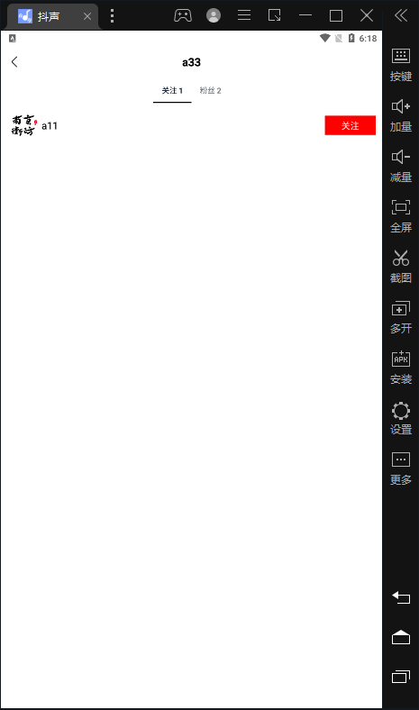

# dousheng

# 项目技术栈：

gin，gorm，redis，rabbitmq，lumberjack，zap，viper

详细文档见：https://ovkcgkei1q.feishu.cn/docx/doxcn6jqs6WNmn0gnIcik2QWr4f

## 基础接口

### 视频流接口

按照发布时间倒序的视频列表，读取redis标识是否点赞


### 用户注册

claims由UserID和StandardClaims构成

### 用户登录

校验用户名和密码，签名返回jwt

### 用户信息

校验token，根据userid显示信息，不返回token，所以不刷新token


### 投稿接口

1.使用阿里云oss存储视频和封面

2.使用ffmpeg-go来生成cover

### 发布列表

校验token，根据userid获取发布的视频，并按照发布时间倒序返回结果，读取redis标识是否点赞

## 扩展接口

### 赞操作

1. 使用time/rate实现基于令牌桶的限流器

2. 使用redis作缓存来防止用户重复发出请求，保证幂等性

3. 使用rabbitmq来削峰和降流

### 点赞列表

校验token，根据userid获取点赞的视频，并按照发布时间倒序返回结果

### 评论操作

1. 校验token
2. 根据action_type进行评论或是删除
3. 只有评论作者和视频作者可以删除评论

### 评论列表

校验token，根据videoid获取发布的评论，并按照发布时间倒序返回结果，已返回完整信息，但客户端无法展示用户名


## 扩展接口

### 关注操作

1. 校验token
2. 根据action_type进行关注或者取关，mysql，redis均存储信息

### 关注列表

校验token和userid，按照关注时间倒序返回列表



### 粉丝列表

校验token和userid，按照关注时间倒序返回列表


# 优化方案

## 1.对于一对多，多对多的关联关系

设置status，软删除来减少delete和create开销，以及保留数据

## 2.索引

comment

```sql
KEY `video_state` (`video_id`,`state`)
```

follow，符合最左匹配原则

```sql
UNIQUE KEY `user_id` (`user_id`,`follow_id`)
```

user

```sql
UNIQUE KEY `login` (`user_name`,`password`)
```

user_video，id设置均为自增，使用btree

```sql
UNIQUE KEY `user_video_rel` (`user_id`,`video_id`) USING BTREE
```

video

```sql
KEY `author_id` (`author_id`)
```

## 3.SQL注入

1.gorm自带防sql注入

2.对于first，find的结果，会进行结果校验是否有效

## 4.token

认证：token + redis or jwt ？

使用jwt，此项目较为简单，无需服务端存储session，去中心化，相较于token，可以减少数据库io，且jwt实现跨域。

## 5.点赞，关注

存在高并发场景

解决方案：

1.使用基于令牌桶的限流器

2.使用redis做缓存来快速读取数据

3.参数校验，防止用户重复操作

4.rabbitmq异步进行消费，未解决重复消费，目前采用设置Qos

5.目前只对点赞进行了处理，待后续点赞完善后再更新关注

## 6.视频投稿

使用阿里云oss存储，首次使用localStorge开启服务，但io效果不佳，改为使用oss。

使用阿里云，后续支持七牛云

由于经费问题，其余均在本地搭建环境和运行

TODO：

1.未处理大文件上传，未使用压缩，未处理阿里云oss由于大文件上传的限制，应进行分片处理

2.上传视频和封面生成较慢，后续应继续优化

## 7.日志

使用lumberjack和zap进行日志切割和归档

## 8.gorm

PrepareStmt，SkipDefaultTransaction设置为true

预编译：一次编译、多次运行，省去了解析优化等过程；能防止sql注入

关闭事务

## 9.事务

关注，点赞，评论操作涉及到使用多表，使用事务保持一致性

## 9.ID生成

最初使用基于时间生成的UUID和自增ID，保证了全球唯一性，缺点为暴露时间和MAC

后改为雪花算法，因其对于存储空间、查询效率、传输数据量等有较高要求的场景有更好的效果

SnowFlake的优点是，整体上按照时间自增排序，并且整个分布式系统内不会产生ID碰撞(由数据中心ID和机器ID作区分)，并且效率较高，经测试，SnowFlake每秒能够产生26万ID左右。

TODO：未解决时间回拨

解决方案：

- 将ID生成交给少量服务器，并关闭时钟同步。

- 直接报错，交给上层业务处理。

- 如果回拨时间较短，在耗时要求内，比如5ms，那么等待回拨时长后再进行生成。

- 如果回拨时间很长，那么无法等待，可以匀出少量位（1~2位）作为回拨位，一旦时钟回拨，将回拨位加1，可得到不一样的ID，2位回拨位允许标记三次时钟回拨，基本够使用。如果超出了，可以再选择抛出异常。

# Configure Env:

1.  ## MySQL8.0：

```sql
DROP TABLE IF EXISTS `comment`;

CREATE TABLE `comment` (
  `id` BIGINT(20) NOT NULL COMMENT '主键' AUTO_INCREMENT,
  `user_id` varchar(20) DEFAULT NULL COMMENT '评论用户',
  `video_id` varchar(20) NOT NULL COMMENT '视频id',
  `content` text NOT NULL COMMENT '评论内容',
	`create_time` DATETIME NULL DEFAULT NULL COMMENT '创建时间',
	`state` BOOLEAN DEFAULT NULL COMMENT '状态',
  PRIMARY KEY (`id`),
	KEY `video_state` (`video_id`,`state`)
) ENGINE=InnoDB DEFAULT CHARSET=utf8mb4 COMMENT='评论表';
```


```sql
DROP TABLE IF EXISTS `follow`;

CREATE TABLE `follow` (
  `id` BIGINT(20) NOT NULL COMMENT '主键' AUTO_INCREMENT,
  `user_id` BIGINT(20) NOT NULL COMMENT '用户',
  `follow_id` BIGINT(20) NOT NULL COMMENT '关注的用户',
	`state` BOOLEAN NOT NULL COMMENT '是否关注',
  PRIMARY KEY (`id`),
  UNIQUE KEY `user_id` (`user_id`,`follow_id`)
) ENGINE=InnoDB DEFAULT CHARSET=utf8mb4 COMMENT='用户关注用户关联关系表';
```


```sql
DROP TABLE IF EXISTS `user`;

CREATE TABLE `user` (
  `id` BIGINT(20) NOT NULL COMMENT '主键' AUTO_INCREMENT,
  `name` VARCHAR(64) NOT NULL COMMENT '用户名',
  `password` VARCHAR(64) NOT NULL COMMENT '密码',
  `follow_count` int(11) DEFAULT '0' DEFAULT '0' COMMENT '关注人数',
	`follower_count`int(11) DEFAULT '0' DEFAULT '0' COMMENT '粉丝数',
  PRIMARY KEY (`id`),
  UNIQUE KEY `login` (`name`,`password`)
) ENGINE=InnoDB DEFAULT CHARSET=utf8mb4 COMMENT='用户表';
```


```sql
DROP TABLE IF EXISTS `user_video`;

CREATE TABLE `user_video` (
  `id` BIGINT(20) NOT NULL COMMENT '主键' AUTO_INCREMENT,
  `user_id` varchar(64) NOT NULL COMMENT '用户',
  `video_id` varchar(64) NOT NULL COMMENT '视频',
	`state` BOOLEAN NOT NULL COMMENT '是否喜欢',
  PRIMARY KEY (`id`),
  UNIQUE KEY `user_video_rel` (`user_id`,`video_id`) USING BTREE,
	KEY `user_favorite` (`user_id`,`status`)
) ENGINE=InnoDB DEFAULT CHARSET=utf8mb4 COMMENT='用户喜欢的/赞过的视频';
```


```sql
DROP TABLE IF EXISTS `video`;

CREATE TABLE `video` (
  `id` BIGINT(20) NOT NULL COMMENT '主键' AUTO_INCREMENT,
	`title` varchar(64) NOT NULL COMMENT '视频标题',
  `author_id` BIGINT(20) NOT NULL COMMENT '发布者id',
	`create_time` DATETIME NULL DEFAULT NULL COMMENT '创建时间',
  `play_url` varchar(600) NOT NULL COMMENT '视频存放的路径',
  `cover_url` varchar(600) DEFAULT NULL COMMENT '视频封面图',
  `favorite_count` bigint(20) NOT NULL DEFAULT '0' COMMENT '喜欢/赞美的数量',
	`comment_count` bigint(20) NOT NULL DEFAULT '0' COMMENT '评论的数量',
	`is_favorite` BOOLEAN COMMENT '是否喜欢',
  PRIMARY KEY (`id`),
	KEY `author_id` (`author_id`)
) ENGINE=InnoDB DEFAULT CHARSET=utf8mb4 COMMENT='视频信息表';
```
